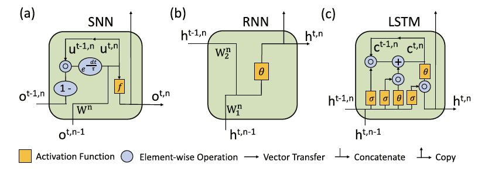

# Comparing SNNs and RNNs on neuromorphic vision datasets: Similarities and differences (Code In Process)

  

**Note: The repository is in process, not the final version.**

This repository contains the code associated with [Comparing SNNs and RNNs on neuromorphic vision datasets: Similarities and differences](https://arxiv.org/abs/2005.02183). This code has most recently been tested with Python 3.7 and Pytorch 1.1.0.

## Introduction
Neuromorphic data, recording frameless spike events, have attracted considerable attention for the spatiotemporal information components and the event-driven processing fashion. Spiking neural networks (SNNs) represent a family of event-driven models with spatiotemporal dynamics for neuromorphic computing, which are widely benchmarked on neuromorphic data. Interestingly, researchers in the machine learning community can argue that recurrent (artificial) neural networks (RNNs) also have the capability to extract spatiotemporal features although they are not event-driven. Thus, the question of ‘‘what will happen if we benchmark these two kinds of models together on neuromorphic data’’ comes out but remains unclear.

In this work, we make a systematic study to compare SNNs and RNNs on neuromorphic data, taking the vision datasets as a case study. First, we identify the similarities and differences between SNNs and RNNs (including the vanilla RNNs and LSTM) from the modeling and learning perspectives. To improve comparability and fairness, we unify the supervised learning algorithm based on backpropagation through time (BPTT), the loss function exploiting the outputs at all timesteps, the network structure with stacked fully-connected or convolutional layers, and the hyper-parameters during training. Especially, given the mainstream loss function used in RNNs, we modify it inspired by the rate coding scheme to approach that of SNNs. Furthermore, we tune the temporal resolution of datasets to test model robustness and generalization. At last, a series of contrast experiments are conducted on two types of neuromorphic datasets: DVS-converted (N-MNIST) and DVS-captured (DVS Gesture). Extensive insights regarding recognition accuracy, feature extraction, temporal resolution and contrast, learning generalization, computational complexity and parameter volume are provided, which are beneficial for the model selection on different workloads and even for the invention of novel neural models in the future.

## Usage and Datasets

We provide N-MNIST dataset by [google drive](https://drive.google.com/drive/folders/1UvOFPKMSkL6BEuEVmr_NBfVuJW8vWDWY?usp=sharing). As for dvs-gesture dataset, please download from [ibm link](https://ibm.ent.box.com/s/3hiq58ww1pbbjrinh367ykfdf60xsfm8).

## Citations

If you find this code useful in your research, please consider citing:

[Weihua He, YuJie Wu, Lei Deng, Guoqi Li, Haoyu Wang, Yang Tian, Wei Ding, Wenhui Wang, Yuan Xie, "Comparing SNNs and RNNs on neuromorphic vision datasets: Similarities and differences", Neural Networks, 2020](https://arxiv.org/abs/2005.02183)

```
@article{he2020comparing,
  title={Comparing SNNs and RNNs on neuromorphic vision datasets: Similarities and differences},
  author={He, Weihua and Wu, YuJie and Deng, Lei and Li, Guoqi and Wang, Haoyu and Tian, Yang and Ding, Wei and Wang, Wenhui and Xie, Yuan},
  journal={Neural Networks},
  volume={132},
  pages={108--120},
  year={2020},
  publisher={Elsevier}
}
```
